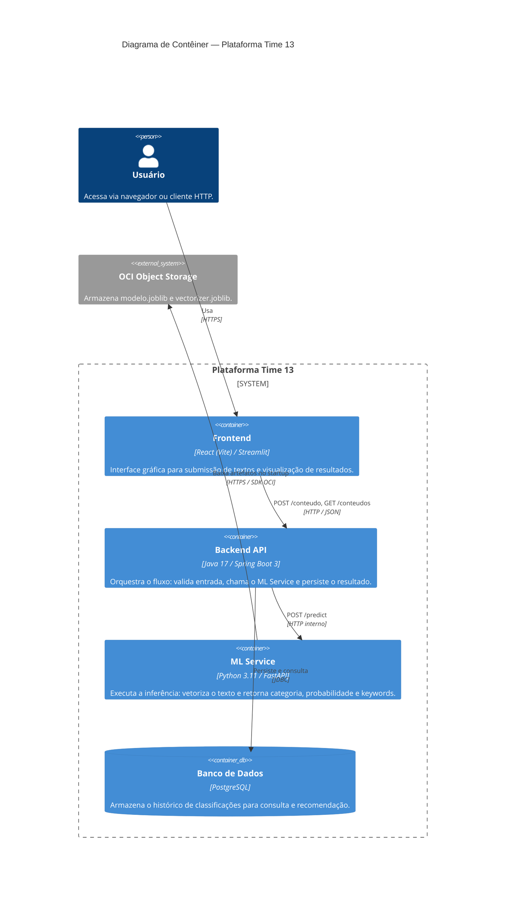
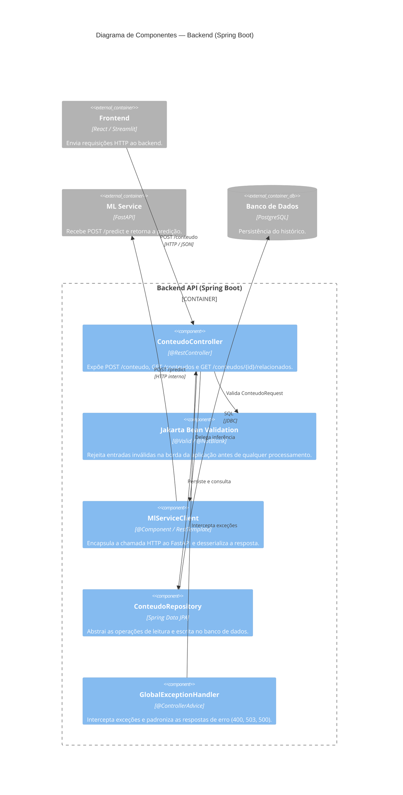
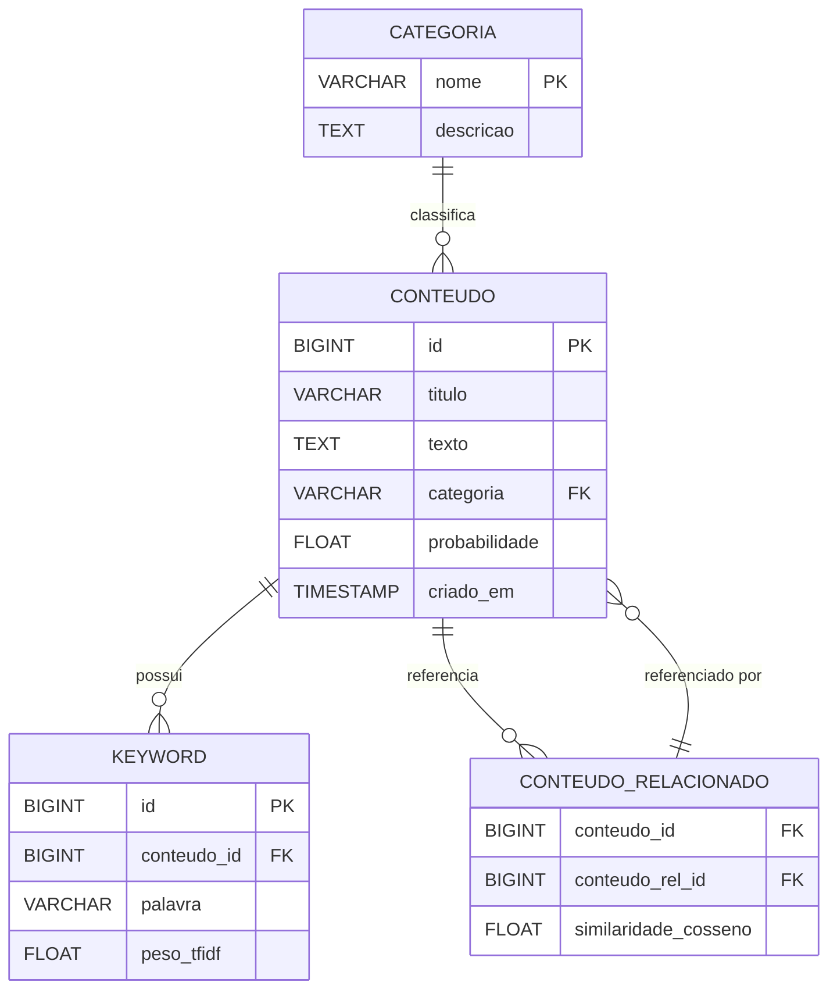
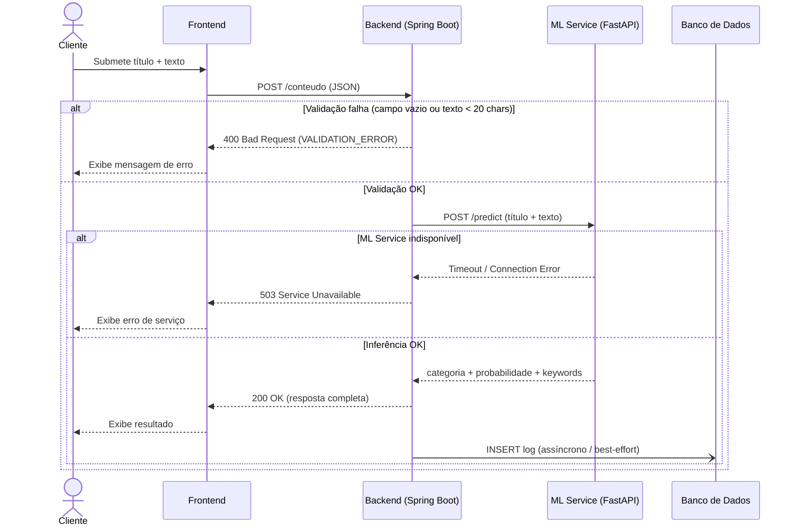
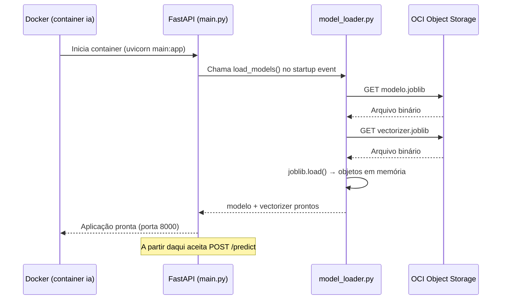
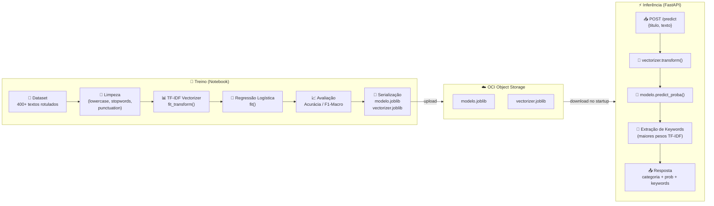
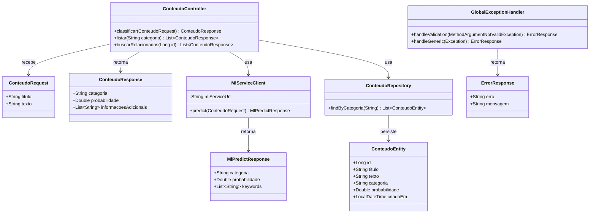

# Diagramas Técnicos — Time 13

> Documentação visual detalhada da arquitetura e fluxos internos do projeto.
> Para visualizar, use a extensão **Markdown Preview Mermaid Support** (`bierner.markdown-mermaid`) no VS Code e abra o preview com `Cmd+Shift+V`.
>
> ⚠️ Os diagramas C4 (`C4Container`, `C4Component`) exigem suporte adicional. Use [mermaid.live](https://mermaid.live) caso não renderizem no VS Code.

---

## 1. C4 Nível 2 — Diagrama de Contêiner

Detalha os processos e tecnologias dentro da plataforma e como se comunicam.



---

## 2. C4 Nível 3 — Diagrama de Componentes (Backend Java)

Detalha os componentes internos do contêiner Backend e suas responsabilidades.



---

## 3. DER — Diagrama de Entidade-Relacionamento

Estrutura das tabelas principais no banco de dados relacional.



---

## 4. Sequência — Fluxo Completo de uma Requisição

Detalha o caminho do `POST /conteudo` desde o cliente até a resposta, incluindo os cenários de erro.



---

## 5. Sequência — Inicialização do ML Service

Mostra o processo de boot do FastAPI antes de aceitar qualquer requisição, garantindo que os artefatos de ML estejam carregados em memória.



---

## 6. Pipeline de ML (Treinamento e Inferência)

Fluxo completo desde o texto bruto até a predição em produção.



---

## 7. Diagrama de Classes — Backend Java

Estrutura das principais classes do módulo `com.time13.conteudo`.



---

## 8. Diagrama de Implantação — OCI Compute

Visão da infraestrutura em produção: containers Docker rodando na VM OCI e suas comunicações.

```mermaid
flowchart TD
    subgraph INTERNET["🌐 Internet"]
        USER["👤 Usuário / Banca"]
    end

    subgraph OCI_COMPUTE["☁️ OCI Compute — VM Ampere A1 (2 OCPUs / 12 GB RAM)"]
        subgraph DOCKER["🐳 Docker Compose"]
            FE_C["frontend\n(React / Streamlit)\n:3000"]
            BE_C["backend\n(Spring Boot)\n:8080"]
            ML_C["ia\n(FastAPI)\n:8000"]
            DB_C["db\n(PostgreSQL)\n:5432"]
        end
    end

    subgraph OCI_STORAGE["☁️ OCI Object Storage"]
        BUCKET["Bucket: modelos\n├── modelo.joblib\n└── vectorizer.joblib"]
    end

    USER -->|HTTPS :443| FE_C
    FE_C -->|HTTP :8080| BE_C
    BE_C -->|HTTP :8000\nPOST /predict| ML_C
    BE_C -->|JDBC :5432| DB_C
    ML_C -->|HTTPS (SDK OCI)\ndownload na inicialização| BUCKET
```

---

*Gerado em: 2025 · Time 13 — Hackathon ONE (Alura + Oracle)*
