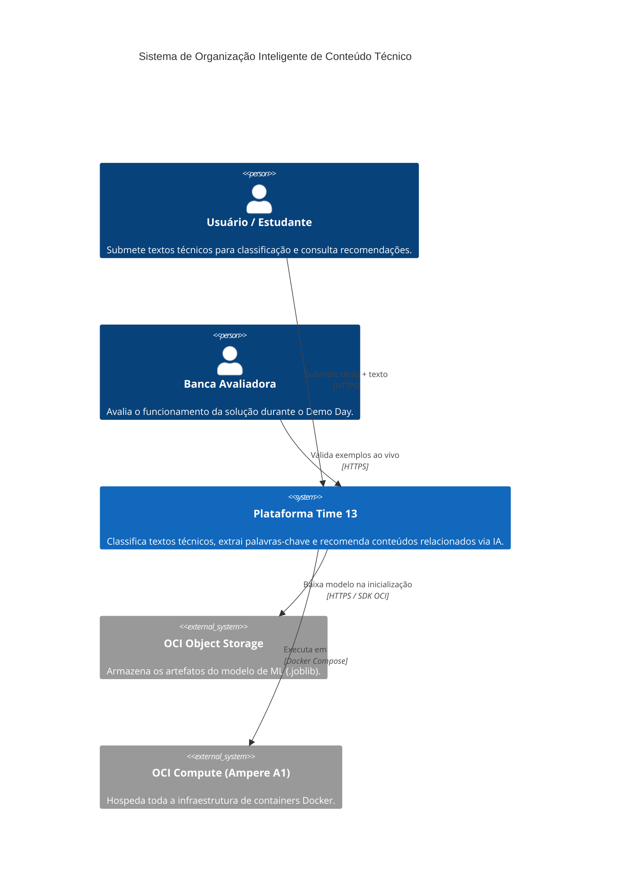
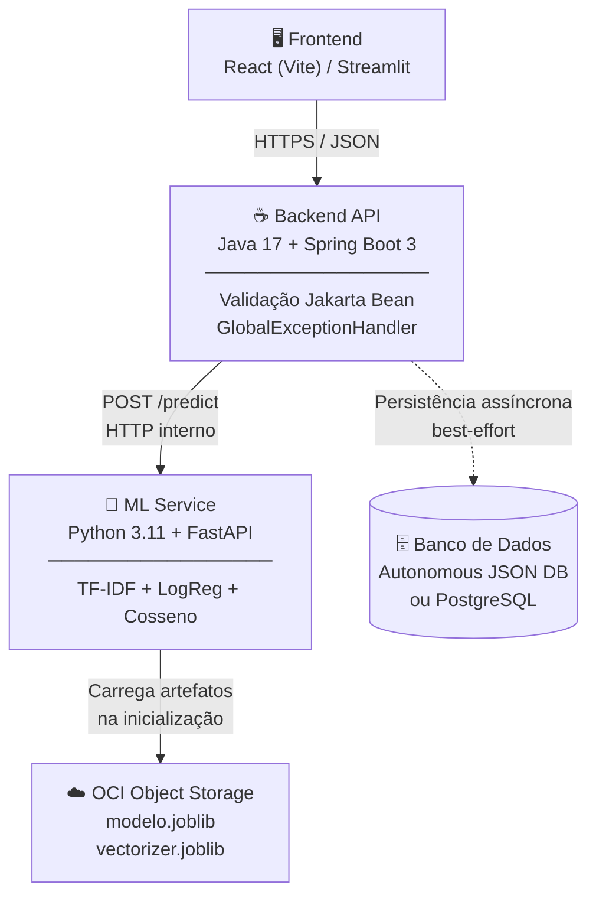
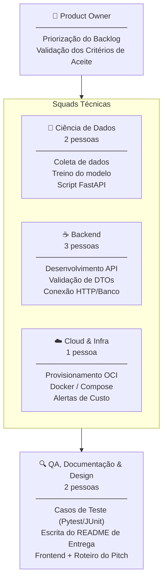
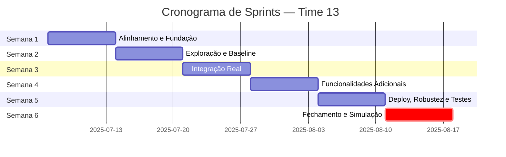

Aqui está uma proposta de **planejamento unificado e otimizado**, consolidando o rigor estrutural do primeiro documento (divisão de papéis, estratégia Git, padrões de código e rotinas do Trello) com a expansão de escopo viável e inteligência de custos (OCI Always Free) do segundo documento.

Este plano foi desenhado especificamente para a realidade de **8 pessoas** trabalhando ao longo de **6 semanas**, mitigando os riscos de integração entre as stacks de Java e Python e blindando o MVP contra cobranças acidentais na nuvem.

---

# Plano Unificado de MVP — Organização Inteligente de Conteúdo Técnico
**Hackathon ONE (Alura + Oracle) | Grupo G9 — Time 13**
**Versão:** 2.0 (Otimizada para 6 semanas)  
**Equipe:** 8 pessoas · **Product Owner:** Você

---

## 1. Sumário Executivo & Objetivos de Sucesso

Este documento serve como a **Fonte Única de Verdade (SSOT)** para o projeto do Time 13. O objetivo é construir uma solução inteligente que receba textos técnicos e retorne, via API REST, sua classificação temática, probabilidade, palavras-chave e recomendações de conteúdos relacionados.

* **Critério de Sucesso nº 1 (MVP Obrigatório):** Entregar 100% do escopo obrigatório do edital funcionando de ponta a ponta, hospedado na Oracle Cloud Infrastructure (OCI) sob o tier *Always Free*, acompanhado de documentação impecável e 3 exemplos funcionais.
* **Critério de Sucesso nº 2 (Diferenciais Viáveis):** Aproveitar a extensão do prazo para 6 semanas para incluir recursos adicionais de alto valor (como persistência, clustering e recomendação) sem inflar a complexidade do código ou o risco de entrega.

---

## 2. Escopo do Produto (Matriz de Priorização)

Para maximizar a nota dos avaliadores sem estourar o cronograma, o escopo foi unificado e dividido rigidamente:

### 🚀 O Núcleo do MVP (Obrigatório)
1. **POST /conteudo:** Endpoint que recebe título + texto e retorna categoria, probabilidade e palavras-chave (extraídas via maiores pesos TF-IDF).
2. **Notebook de Ciência de Dados:** Arquivo único contendo a Análise Exploratória (EDA), limpeza de dados, engenharia de features, treinamento do modelo (TF-IDF + Regressão Logística), avaliação de métricas (Acurácia/F1-Macro) e serialização (.joblib).
3. **Integração Nativa OCI:** Upload automático e consumo do modelo via OCI Object Storage e hospedagem da infraestrutura na OCI Compute.
4. **README & Demo:** Roteiro estruturado com o fluxo lógico e execução limpa de 3 exemplos reais cobrindo 3 categorias distintas.

### ✨ Adicionais de Alto Valor (Inclusos no MVP pelo tempo extra)
5. **Persistência de Resultados:** Armazenamento do histórico em banco de dados relacional ou no *Autonomous JSON Database*.
6. **Recomendação de Relacionados:** Endpoint `GET /conteudos/{id}/relacionados` baseado em cálculo de similaridade por cosseno.
7. **Agrupamento Automático (Clustering):** Algoritmo KMeans para agrupar conteúdos e gerar *insights* macro sobre a base de conhecimento.
8. **Filtro e Busca:** Consulta simples de históricos indexados por categoria.
9. **Containerização:** Uso de Docker e Docker Compose para isolamento do banco e dos serviços.

### 🛑 Fora do Escopo (Apenas se houver tempo de sobra na Semana 5)
* Busca semântica avançada com LLMs/embeddings complexos, processamento em lote via CSV em larga escala e ferramentas pesadas de infraestrutura (ex: Kubernetes/Kafka).

---

## 3. Arquitetura da Solução

Adotamos a **Opção B (Arquitetura Desacoplada de Duas Camadas)** como oficial, pois ela resolve o principal risco de um time heterogêneo: permite o paralelismo real entre as squads de Java e Python desde o primeiro dia através de um contrato de API estrito.

### 🗺️ C4 Nível 1 — Diagrama de Contexto

> Visão de alto nível: quem usa o sistema e com quais serviços externos ele se comunica.



---

### 📐 Diagrama de Fluxo Lógico



### 🧠 Explicação do Fluxo Crítico
1. O cliente envia título e texto ao Backend (Java/Spring Boot).
2. O Spring Boot valida o tamanho e consistência dos campos e repassa a carga para o serviço de Machine Learning (Python/FastAPI) através de uma requisição HTTP interna estável (`POST /predict`).
3. O FastAPI, que já possui o classificador e o vetorizador carregados na memória vindos do **OCI Object Storage**, processa o texto, gera os pesos TF-IDF e extrai os metadados.
4. O Spring Boot recebe a resposta, repassa imediatamente para o Frontend e dispara, de forma assíncrona/best-effort, a gravação do log na camada de persistência. Se o banco falhar, a API continua respondendo ao usuário.

---

## 4. Stack Tecnológica & Gestão de Custos OCI

Todas as ferramentas escolhidas são gratuitas, robustas e amplamente documentadas.

### 🛠️ Especificação de Tecnologias

| Camada | Tecnologia Escolhida | Justificativa Técnica |
| :--- | :--- | :--- |
| **Frontend** | React (Vite) ou Streamlit | Setup instantâneo; Streamlit permite prototipação ultra rápida focada em dados. |
| **Backend API** | Java 17 + Spring Boot 3 | Padrão corporativo, robusto no tratamento de exceções com `@ControllerAdvice`. |
| **Serviço de ML** | Python 3.11 + FastAPI | Geração automática de documentação interativa (Swagger) e tipagem nativa. |
| **Algoritmos** | TF-IDF + Regressão Logística + KMeans | Modelo leve, interpretável, rápido de treinar e ideal para datasets pequenos (400-600 itens). |
| **Persistência** | Autonomous JSON DB ou PostgreSQL | Integração madura via Spring Data JPA ou drivers nativos de alta performance. |

### 💰 Estratégia OCI Always Free (Garantia de Custo Zero)
Para blindar o projeto contra custos inesperados na criação de contas estudantis, a infraestrutura seguirá à risca os seguintes recursos elegíveis permanentes:
* **OCI Compute (Ampere A1):** Alocação de até 2 OCPUs e 12 GB de RAM no total para rodar os containers da aplicação.
* **OCI Object Storage:** Bucket configurado no tier *Standard* contendo o arquivo `modelo.joblib` e `vectorizer.joblib` dentro do limite gratuito de 20 GB.
* **Ação Preventiva de Segurança:** Criação obrigatória de um **Budget Alert de US$ 1,00** nas configurações de Governança da Tenancy na Semana 1. Qualquer desvio gera um alerta imediato por e-mail.

---

## 5. Estrutura do Monorepo do Projeto

Centralizar todo o desenvolvimento em um único repositório facilita a governança de código de uma equipe júnior e evita erros de sincronização de contratos de API.

```text
time13-hackathon/
├── .github/               # Workflows e automações
├── frontend/              # Interface do Usuário (React ou Streamlit)
├── backend/               # Código-fonte Java / Spring Boot
│   ├── src/main/java/com/time13/conteudo/
│   │   ├── controller/    # Expõe POST /conteudo e GET /conteudos
│   │   ├── client/        # MlServiceClient (Consome o FastAPI interno)
│   │   ├── dto/           # Estruturas de Request/Response limpas
│   │   ├── entity/        # Mapeamento do banco de dados (JPA)
│   │   └── exception/     # GlobalExceptionHandler
│   └── pom.xml
├── ia/                    # Squad de Ciência de Dados (Python)
│   ├── notebooks/         # Jupyter Notebooks de treino e EDA (Entregável do Edital)
│   ├── app/               # API de inferência FastAPI
│   │   ├── main.py        # Router do FastAPI (POST /predict)
│   │   ├── model_loader.py# Código que lê o .joblib do Object Storage na subida
│   │   └── keywords.py    # Algoritmo de extração via pesos de features do TF-IDF
│   └── requirements.txt
├── infra/                 # Scripts Docker, compose e automações OCI
└── docs/                  # README.md principal, exemplos e roteiro do Pitch

```

---

## 6. Governança, Divisão da Equipe & Papéis

Com 8 integrantes e 6 semanas, os papéis foram distribuídos para que nenhuma funcionalidade crítica dependa exclusivamente de uma única mente (evitando gargalos).



---

## 7. Cronograma Macro das Sprints (6 Semanas)

A evolução do cronograma respeita a ordem lógica de desenvolvimento: **Alinhamento ➔ Fundação ➔ Integração Real ➔ Robustez ➔ Consolidação ➔ Entrega**.



* **Semana 1 — Alinhamento e Fundação:** Coleta do dataset inicial (meta de 400+ textos técnicos rotulados). Criação do esqueleto da API em Spring Boot configurada com um **mock estático** do JSON final do edital. O time de infraestrutura cria a conta na OCI e ativa o Alerta de Orçamento.
* **Semana 2 — Exploração e Baseline:** Execução do notebook de EDA. Engenharia de features inicial com TF-IDF. Configuração inicial das rotas do FastAPI localmente. Frontend inicia o desenvolvimento das telas consumindo o mock do backend.
* **Semana 3 — Integração Real:** O modelo é gerado em `.joblib`, hospedado no bucket da OCI e consumido pelo FastAPI. O Backend em Java desativa o mock e passa a orquestrar chamadas reais para o serviço em Python.
* **Semana 4 — Funcionalidades Adicionais:** Implementação da lógica de cálculo de similaridade por cosseno para o recomendador e agrupamento KMeans. Configuração do Docker Compose unificando os microsserviços.
* **Semana 5 — Deploy, Robustez e Testes:** Implantação da aplicação na VM Compute da OCI. Cobertura de testes unitários para os endpoints principais. Tratamento completo de entradas de dados malformadas. Escrita robusta do README do repositório.
* **Semana 6 — Fechamento e Simulação:** Ajustes de performance em ambiente de nuvem, gravação de um vídeo de backup da demonstração, ensaios cronometrados do pitch e entrega final dos links na plataforma do hackathon.

> ⚠️ **Regra de Corte de Escopo:** Se na virada da Semana 3 para a Semana 4 a integração básica (`POST /conteudo` real operando em nuvem) não estiver 100% estável, as features de KMeans e Recomendação por Cosseno são automaticamente congeladas. Toda a equipe migra os esforços para estabilizar o núcleo obrigatório do MVP.

---

## 8. Padrões de Engenharia & Qualidade

### 🌿 Estratégia de Branching (Git Flow Simplificado)

* `main`: Contém exclusivamente o código em estado estável de produção espelhado no deploy da OCI.
* `develop`: Branch de integração contínua das squads. Todo PR deve ser revisado por pelo menos um Tech Lead antes de entrar aqui.
* `feature/<squad>-<nome_funcionalidade>`: Branches efêmeras criadas para o desenvolvimento de demandas isoladas (Ex: `feature/backend-validation-dto`).

### 💬 Mensagens de Commit (Conventional Commits)

Garante clareza absoluta na leitura do histórico de desenvolvimento do projeto:

* `feat(ia): adiciona extração de keywords baseada em pesos tf-idf`
* `fix(backend): corrige vazamento de exceção interna no erro 500`
* `docs(infra): atualiza variáveis de ambiente do docker-compose no readme`

### ⚙️ Regras Práticas de Desenvolvimento técnico

* **Modelos Prontos na Subida:** O script Python *nunca* deve recarregar o arquivo `.joblib` a cada requisição HTTP recebida. O carregamento deve ser feito uma única vez na inicialização da aplicação (`model_loader.py`).
* **Validação Defensiva:** O Spring Boot deve utilizar validações declarativas Jakarta Bean Validation (`@NotBlank`, `@Size(min=20, max=5000)`) para rejeitar requisições inválidas imediatamente na borda da aplicação, poupando processamento na camada de IA.

---

## 9. Especificação e Contrato da API Principal

### Contrato Estrito: `POST /conteudo`

**Requisição (JSON):**

```json
{
  "titulo": "Introdução ao Spring Boot",
  "texto": "Neste conteúdo são apresentados os conceitos básicos para criação de APIs REST utilizando Java e Spring Boot."
}

```

**Resposta de Sucesso (200 OK):**

```json
{
  "categoria": "Backend",
  "probabilidade": 0.89,
  "informacoes_adicionais": [
    "Java",
    "Spring Boot",
    "API REST"
  ]
}

```

**Resposta de Erro de Validação (400 Bad Request):**

```json
{
  "erro": "VALIDATION_ERROR",
  "mensagem": "O campo texto é obrigatório e deve conter entre 20 e 5000 caracteres."
}

```

---

## 10. Planejamento do Roteiro de Apresentação (Pitch / Demo Day)

**Tempo total estimado:** 5 a 7 minutos (Máximo tolerado em bancas de Hackathon).

1. **Minuto 0.0 a 1.0 (O Problema — PO):** Contextualização rápida sobre a sobrecarga de informações que estudantes/profissionais de tecnologia sofrem e o impacto financeiro/produtivo de catalogar isso manualmente.
2. **Minuto 1.0 a 2.5 (A Inteligência — Tech Lead Dados):** Demonstração visual rápida das métricas obtidas no notebook de Ciência de Dados (Acurácia/F1-score) explicando sucintamente o funcionamento do pipeline TF-IDF + Regressão Logística.
3. **Minuto 2.5 a 5.0 (A Solução Real — Tech Leads Dev):** Exibição da aplicação funcionando em tempo real na URL pública hospedada na OCI. Submissão sequencial dos **3 exemplos obrigatórios de teste** previstos no edital para validação imediata da banca examinadora.
4. **Minuto 5.0 a 6.0 (Infraestrutura e Encerramento — Cloud Architect & PO):** Demonstração do painel de controle da OCI comprovando o uso de serviços nativos (Object Storage/Compute) operando perfeitamente sob os limites do plano gratuito e considerações finais de mercado.